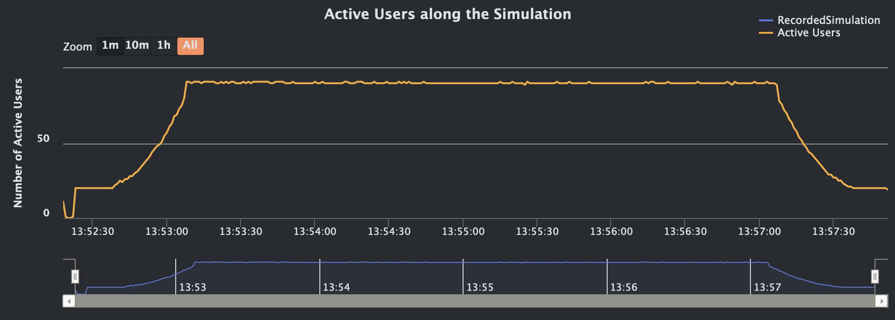
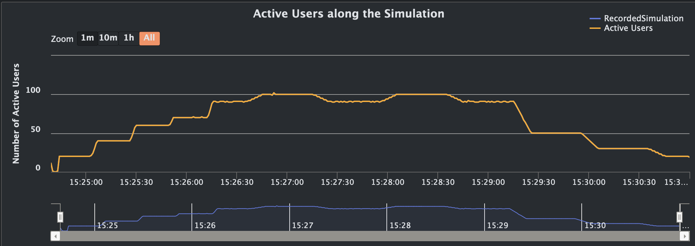

## Final Project for DevOps Course

# Overview

`This project is a culmination of the DevOps principles and practices we've explored in our course. Working in groups of 4-5, our task is to deliver a simple web application from development into production. This involves orchestrating, deploying, automating, monitoring, and analyzing the application's performance to ensure reliability and efficiency in a real-world scenario.`

# Load Test

# Stress Test

